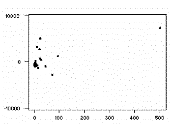

# Linear Regression

http://www.stat.yale.edu/Courses/1997-98/101/linreg.htm#:~:text=A%20linear%20regression%20line%20has,y%20when%20x%20%3D%200). 

## Residuals
Once a regression model has been fit to a group of data, examination of the residuals (the deviations from the fitted line to the observed values) allows the modeler to investigate the validity of his or her assumption that a linear relationship exists. Plotting the residuals on the y-axis against the explanatory variable on the x-axis reveals any possible non-linear relationship among the variables, or might alert the modeler to investigate lurking variables. In our example, the residual plot amplifies the presence of outliers.

## Lurking Variables
If non-linear trends are visible in the relationship between an explanatory and dependent variable, there may be other influential variables to consider. A lurking variable exists when the relationship between two variables is significantly affected by the presence of a third variable which has not been included in the modeling effort. Since such a variable might be a factor of time (for example, the effect of political or economic cycles), a time series plot of the data is often a useful tool in identifying the presence of lurking variables.

## Extrapolation
Whenever a linear regression model is fit to a group of data, the range of the data should be carefully observed. Attempting to use a regression equation to predict values outside of this range is often inappropriate, and may yield incredible answers. This practice is known as extrapolation. Consider, for example, a linear model which relates weight gain to age for young children. Applying such a model to adults, or even teenagers, would be absurd, since the relationship between age and weight gain is not consistent for all age groups.
## ROC Curve
A Receiver Operating Characteristic (ROC) curve is a graphical representation of the performance of a binary classification model at various classification thresholds. It illustrates the trade-off between the true positive rate (sensitivity) and the false positive rate (1 - specificity) as the discrimination threshold is varied.

Here's how the ROC curve works:

1. **Binary Classification**:
   - The ROC curve is commonly used for binary classification problems, where the goal is to distinguish between two classes (positive and negative).

2. **True Positive Rate (Sensitivity)**:
   - The true positive rate (TPR), also known as sensitivity or recall, is the proportion of actual positive instances correctly predicted by the model.
   - \(TPR = \frac{TP}{TP + FN}\)

3. **False Positive Rate (1 - Specificity)**:
   - The false positive rate (FPR), also known as the complement of specificity, is the proportion of actual negative instances incorrectly predicted as positive by the model.
   - \(FPR = \frac{FP}{FP + TN}\)

4. **Threshold Variation**:
   - The ROC curve is created by varying the discrimination threshold of the classifier and plotting the TPR against the FPR at each threshold.
   - As the threshold increases, the TPR usually decreases, and the FPR also decreases.

5. **Random Classifier Line**:
   - The ROC curve of a random classifier (one that makes predictions irrespective of the input features) is represented by a diagonal line from the bottom left to the top right (the line y = x).

6. **Ideal Classifier Point**:
   - The ideal classifier would have a TPR of 1 and an FPR of 0, resulting in a point at the top left corner of the ROC curve.

7. **Area Under the ROC Curve (AUC-ROC)**:
   - The AUC-ROC value provides a single scalar measure of the performance of a binary classification model. A perfect classifier has an AUC-ROC value of 1, while a random classifier has an AUC-ROC of 0.5.
   - AUC-ROC measures the area under the ROC curve.

8. **Choosing the Threshold**:
   - The choice of the threshold depends on the specific requirements of the classification task. A higher threshold may prioritize specificity, while a lower threshold may prioritize sensitivity.

9. **Use in Model Evaluation**:
   - ROC curves are widely used to evaluate the performance of classifiers, especially in situations where the class distribution is imbalanced.

the ROC curve provides a visual representation of the performance of a binary classification model across different discrimination thresholds. It is a valuable tool for understanding the trade-off between true positive rate and false positive rate and for selecting an appropriate threshold based on the specific needs of the application.

# 

## Bias

- **Definition**:
  - Bias refers to the error introduced by approximating a real-world problem, which may be extremely complex, by a much simpler model.
  - High bias implies that the model is too simplistic and unable to capture the underlying patterns in the data.

- **Characteristics**:
  - Models with high bias tend to oversimplify the relationships in the data and may perform poorly on both the training and unseen data.
  - Commonly associated with underfitting.

- **Examples**:
  - A linear regression model applied to a dataset with a nonlinear underlying pattern may exhibit high bias.

## Variance

- **Definition**:
  - Variance refers to the model's sensitivity to small fluctuations or noise in the training data.
  - High variance implies that the model is capturing not only the underlying patterns but also the noise in the data.

- **Characteristics**:
  - Models with high variance may perform well on the training data but poorly on unseen data, as they adapt too closely to the specific training dataset.
  - Commonly associated with overfitting.

- **Examples**:
  - A complex polynomial regression model applied to a dataset with some random noise may exhibit high variance.

## Bias-Variance Trade-Off

- **Trade-Off**:
  - There is often a trade-off between bias and variance. Increasing model complexity tends to decrease bias but increase variance, and vice versa.
  - The goal is to find the right level of model complexity that minimizes both bias and variance, resulting in optimal predictive performance on new, unseen data.

- **Underfitting and Overfitting**:
  - **Underfitting**: Occurs when a model is too simple, leading to high bias and poor performance on both training and test data.
  - **Overfitting**: Occurs when a model is too complex, capturing noise in the training data and leading to high variance. Performance on training data may be good, but it generalizes poorly to new data.

- **Model Evaluation**:
  - The bias-variance trade-off is crucial when evaluating models. Models should be assessed not only on their performance on training data but also on their ability to generalize to new, unseen data.

- **Regularization**:
  - Techniques such as regularization are used to control the trade-off between bias and variance by penalizing overly complex models.

Understanding the bias-variance trade-off is fundamental for selecting appropriate machine learning models, tuning hyperparameters, and achieving models that generalize well to new, unseen data.

# 

## Bayes' Theorem

**Definition**:
- Bayes' Theorem is a mathematical formula that describes the probability of an event based on prior knowledge of conditions that might be related to the event.
- It is named after Thomas Bayes, an 18th-century statistician and theologian.

**Formula**:
$ P(A|B) = \frac{P(B|A) \cdot P(A)}{P(B)} $ 

- \( P(A|B) \) is the probability of event A occurring given that B has occurred.
- \( P(B|A) \) is the probability of event B occurring given that A has occurred.
- \( P(A) \) and \( P(B) \) are the probabilities of events A and B occurring independently.

**Application**:
- Bayes' Theorem is widely used in statistics, probability theory, and machine learning, especially in Bayesian statistics and Bayesian inference.

## Naive Bayes

**Definition**:
- Naive Bayes is a classification algorithm based on Bayes' Theorem with the assumption that features are conditionally independent given the class label. This assumption simplifies the computation and leads to the term "naive."

**Types of Naive Bayes**:
- **Gaussian Naive Bayes**: Assumes that the features follow a Gaussian distribution.
- **Multinomial Naive Bayes**: Commonly used for discrete data, such as text data (e.g., document classification).
- **Bernoulli Naive Bayes**: Suitable for binary data (e.g., spam detection).

**Assumption of Independence**:
- The "naive" assumption in Naive Bayes is that features are independent, which might not hold in real-world scenarios. Despite this simplification, Naive Bayes can perform well, especially in text classification tasks.

**Application**:
- Naive Bayes is commonly used in spam filtering, text classification, sentiment analysis, and other tasks where the conditional independence assumption holds reasonably well.

## Example: Text Classification with Naive Bayes

Suppose we want to classify an email as spam (S) or not spam (NS) based on the occurrence of words "free" and "discount."

**Features**:
- \( P(\text{"free"}|S) = 0.8 \)
- \( P(\text{"discount"}|S) = 0.6 \)
- \( P(\text{"free"}|NS) = 0.1 \)
- \( P(\text{"discount"}|NS) = 0.2 \)

**Prior Probabilities**:
- \( P(S) = 0.4 \)
- \( P(NS) = 0.6 \)

**Naive Bayes Calculation**:
$$ P(S|\text{"free", "discount"}) \propto P(S) \cdot P(\text{"free"}|S) \cdot P(\text{"discount"}|S) $$
$$ P(NS|\text{"free", "discount"}) \propto P(NS) \cdot P(\text{"free"}|NS) \cdot P(\text{"discount"}|NS) $$

By comparing the probabilities, we can classify the email as spam or not spam.

These concepts are foundational in probability theory, statistics, and machine learning, providing a basis for making probabilistic inferences and classifications.

## Introduction to Navie Bayes

Navie Bayes is a classification algorithm based on Bayes' theorem. According to Bayes' theorem, the conditional probability of an event A, given another event B, is given by P(A|B) = P(B|A)P(A)/P(B). In the context of classification, we can think of P(A) as the prior probability of A, and P(A|B) as the posterior probability of A. In other words, we can think of the posterior probability as the probability of A given the data B.

## Conditional Probability

Conditional probability is the probability of an event given that another event has occurred. For example, let's say that we have two events A and B. The probability of A given that B has occurred is given by:

$$ P(A|B) = \frac{P(A \cap B)}{P(B)} $$
where P(A ∩ B) is the probability of A and B occurring together.

## Bayes' Rule:

Probability of A given B is equal to the probability of interestion of A and B divided by the probability of B.
$$ P(A|B) = \frac{P(A \cap B)}{P(B)} $$
Similarly, we can write the probability of B given A as:
$$ P(B|A) = \frac{P(A \cap B)}{P(A)} $$

If we rearrange the above equation, we get:
$$ P(A|B) = \frac{P(B|A)P(A)}{P(B)} $$

In the context of classification, we can think of P(A) as the prior probability of A, and P(A|B) as the posterior probability of A. In other words, we can think of the posterior probability as the probability of A given the data B.

## Navie Bayes Classifier

For tweets classification, we can use Navie Bayes classifier to classify tweets into positive and negative tweets. 

product of conditional probability of words in tweet of positive class and negative class:
$$ P(positive|tweet) = P(w_1|positive) * P(w_2|positive) * P(w_3|positive) * ... * P(w_n|positive) $$
$$ P(negative|tweet) = P(w_1|negative) * P(w_2|negative) * P(w_3|negative) * ... * P(w_n|negative) $$
where w1, w2, w3, ... , wn are words in tweet.
Calculate likelihood of tweet being positive and negative:
$$
\frac{P(\text{positive}|\text{tweet})}{P(\text{negative}|\text{tweet})} = 
\begin{cases} >1, & \text{positive} \\ <1, & \text{negative} \end{cases}
$$

## Laplacian Smoothing

We usually compute the probability of a word given a class as follows:

$$
P(w_i|\text{class}) = \frac{\text{freq}(w_i, \text{class})}{N_{\text{class}}} \qquad \text{class} \in \{\text{Positive}, \text{Negative}\} 
$$

However, if a word does not appear in the training, then it automatically gets a probability of 0, to fix this we add smoothing as follows

$$
P(w_i|\text{class}) = \frac{\text{freq}(w_i, \text{class}) + 1}{(N_{\text{class}} + V)}
$$

Note that we added a 1 in the numerator, and since there are $V$ words to normalize, we add $V$ in the denominator.

$N_{\text{class}}$: number of words in class

$V$: number of unique words in vocabulary

## Log Likelihood

We can use log likelihood to avoid underflow. The log likelihood is given by:

$$ \lambda(w) = \log \frac{P(w|\text{pos})}{P(w|\text{neg})} $$

where $P(w|\text{pos})$ and $P(w|\text{neg})$ are computed using Laplacian smoothing.

## train naïve Bayes classifier

1) Get or annotate a dataset with positive and negative tweets

2) Preprocess the tweets:

    Lowercase, Remove punctuation, urls, names , Remove stop words , Stemming , Tokenize sentences
    
3) Compute $\text{freq}(w, \text{class})$:

4) Get $P(w|\text{pos}), P(w|\text{neg})$

5) Get $\lambda(w)$

$$
\lambda(w) = \log \frac{P(w|\text{pos})}{P(w|\text{neg})}
$$

6) Compute $\text{logprior}$

$$
\text{logprior} = \log \frac{D_{\text{pos}}}{D_{\text{neg}}}
$$

where $D_{\text{pos}}$ and $D_{\text{neg}}$ correspond to the number of positive and negative documents respectively.

7) Compute Score 
$$\text{logprior} + \sum_{w \in \text{tweet}} \lambda(w) = 
\begin{cases} >1, & \text{positive} \\ <1, & \text{negative} \end{cases}
$$

#
